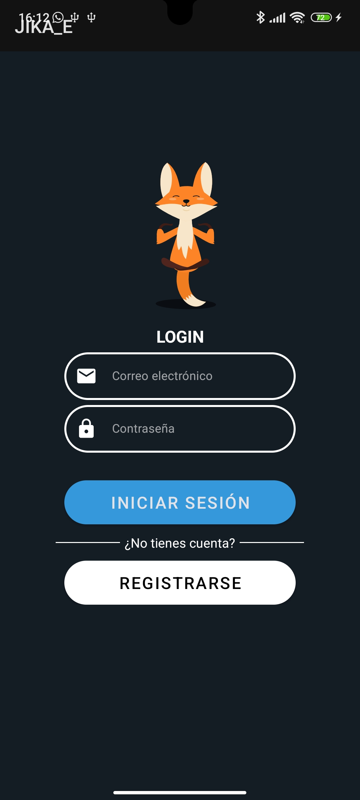
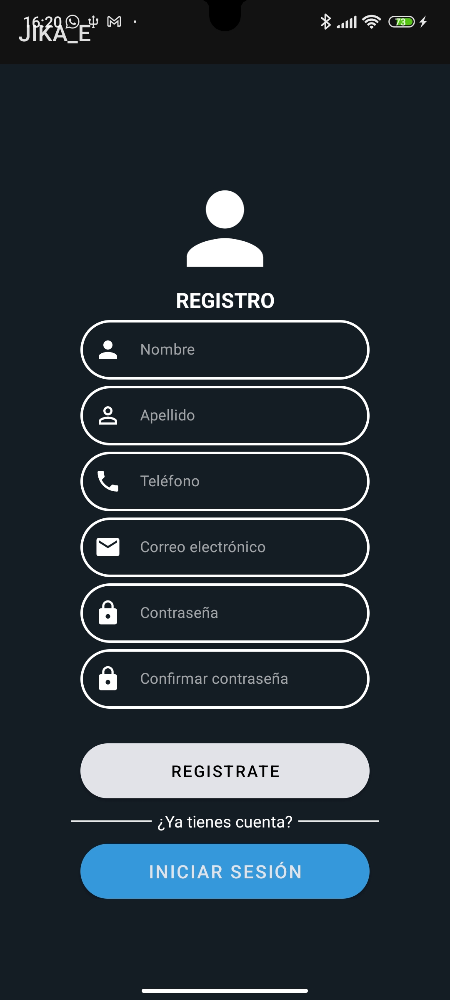
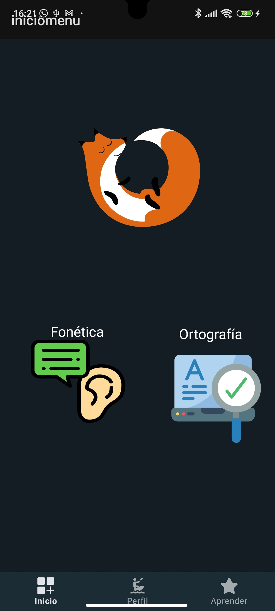
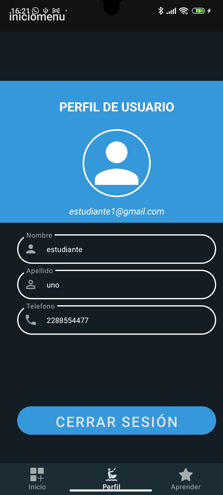
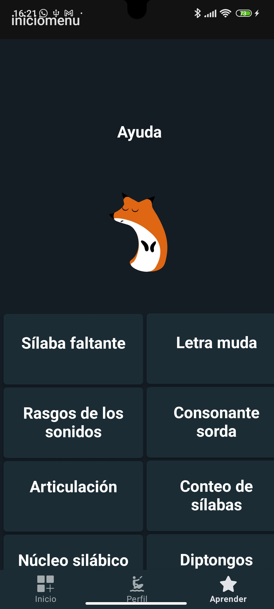

# Jika
Aplicación móvil como apoyo a la enseñanza del idioma español en educación básica.
Para la base de datos se utilizó Firebase para el registro de usuarios.

## 🏞️ Screenshots

### Funcionamiento

### Video

### Login

### Registro

### Inicio

### Profile

### Aprender

